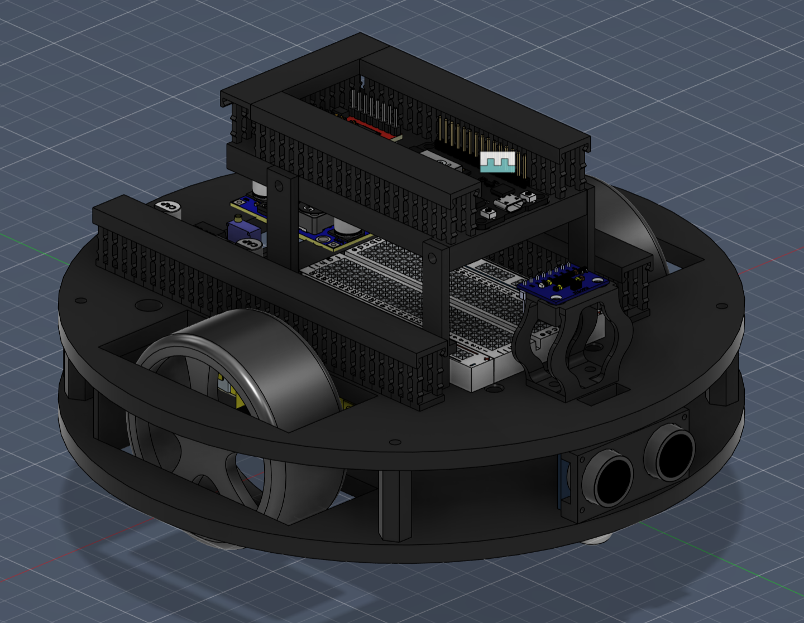
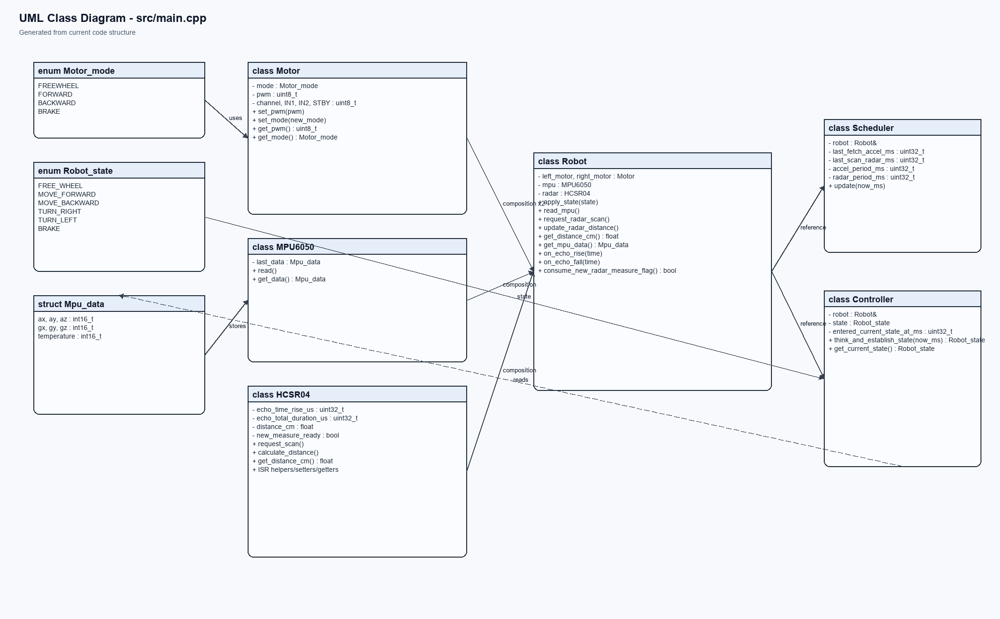

# Robot — plateforme mobile autonome ESP32



**Un robot compact, programmable et évolutif pour explorer la robotique embarquée.**

Ce projet combine une base mobile à deux roues, un ESP32 et un ensemble de capteurs permettant au robot de se déplacer, de mesurer son environnement et de prendre des décisions localement. Il constitue une base claire pour prototyper des comportements autonomes, expérimenter une architecture logicielle embarquée et faire évoluer rapidement la plateforme.

## Ce que le robot sait faire

- Piloter deux moteurs DC avec un pont en H et une commande PWM.
- Mesurer les obstacles avec un capteur ultrasonique **HC-SR04**.
- Lire l'accélération et la vitesse angulaire avec un **MPU6050** via I²C.
- Orchestrer les capteurs et les actionneurs avec une machine à états.
- Fonctionner sur **ESP32** avec le framework Arduino et PlatformIO.

## Pourquoi ce projet ?

Le robot est conçu comme une plateforme de démonstration et d'apprentissage : le câblage est documenté, le code est organisé par responsabilités et la conception peut être adaptée à de nouveaux capteurs, moteurs ou algorithmes de navigation.

## Architecture



Le logiciel est structuré autour de composants simples : `Motor` pour la commande des moteurs, `MPU6050` pour l'IMU, `HCSR04` pour la mesure de distance, puis `Robot`, `Scheduler` et `Controller` pour la façade matérielle, l'ordonnancement et la logique de décision.

## Documentation matérielle

Les schémas électriques et le brochage sont disponibles dans [`Schema/`](Schema/) :

- [Schéma électrique](Schema/Schema%20electrique.jpeg)
- [Brochage GPIO](Schema/GPIO.png)

La vue d'assemblage est disponible ici : [assemblage v1](images/assemblage_v1.png).

## Brochage principal

| Fonction | GPIO |
| --- | ---: |
| Moteur gauche — PWM | 25 |
| Moteur gauche — direction | 33 / 32 |
| Moteur droit — PWM | 27 |
| Moteur droit — direction | 16 / 17 |
| Pont en H — veille | 26 |
| HC-SR04 — TRIG / ECHO | 23 / 34 |
| MPU6050 — SDA / SCL | 21 / 22 |
| MPU6050 — interruption | 35 |

## Organisation du dépôt

```text
├── CAD/        # Fichiers CAO et exports de fabrication
├── Schema/     # Schémas électriques et brochage
├── images/     # Visuels du projet et diagrammes
├── src/        # Firmware ESP32
├── scripts/    # Outils de génération de documentation
└── platformio.ini
```

